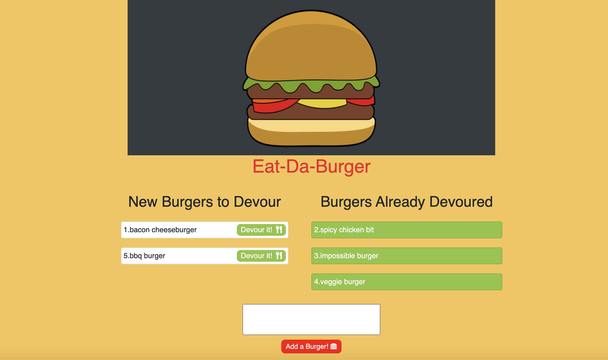

# Burger Devouring App
     

## Description
​This Node app serves as a burger logger where the user can select from a list of burgers to click on to devour or input a custom burger that can then be added to be devoured. This Node app is built using Express and uses MySQL as a database and Handlebars to server the HTML. This app is also deployed on Heroku [here.](https://aqueous-forest-98399.herokuapp.com/)

## Table of Contents 

* [Demo](#demo)

* [Prerequisites](#prerequisites)

* [Installation](#installation)

* [Usage](#usage)

* [License](#license)

* [Contributing](#contributing)
​
* [Questions](#questions)

## Demo

Eat-Da-Burger App live on [Heroku!](https://aqueous-forest-98399.herokuapp.com/)



## Prerequisites

* [Node.js](https://nodejs.dev/)
* [MySQL and MySQL Workbench](https://dev.mysql.com/downloads/mysql)

## Installation

You can clone the repository remotely with the following command line

```
git clone https://github.com/mmoncayo/burger.git
```

The below steps would be for if you'd like to install the app locally, and if so, you can navigate to the 'burger' directory and then follow the next steps:

To install the necessary and relevant dependencies using Node.js, run the following command:

```
npm install
```

There is no installation otherwise necessary if you want to connect to the app, as it is live on Heroku [here.](https://aqueous-forest-98399.herokuapp.com/)


## Usage

You can then run the following command and then go to your browser and enter: ```https://localhost:8080```

```
node server.js
```

Once you've accessed the app locally on your browser, you can begin navigating through the page by either entering a new burger of your preference to add into the list of burgers to be devoured or you can click 'devour it!' on any of the burgers that are to be devoured and then it'll be added to the list of devoured burgers.

## License

This project is licensed under the MIT license.

## Contributing

If you'd like to contribute to the repo, there is potential growth to flare up the styling of the html or possibly add more of an aesthetic to the overall layout of the data for both sections of devoured burgers and to-be devoured burgers. 

If interested in contributing, please reach out to me via GitHub or e-mail to contribute or discuss collaborations.

## Questions

If you have any questions about the repo, open an issue or contact [mmoncayo](https://github.com/mmoncayo) directly at matthew.moncayo@gmail.com.